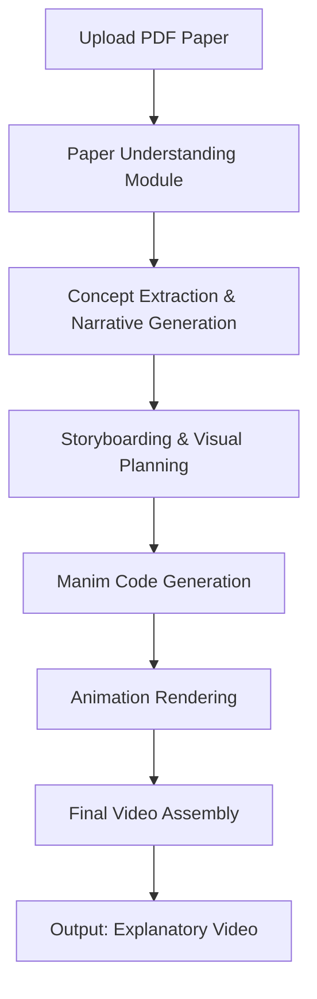

# PRD: Research Paper to 3Blue1Brown-style Explanatory Video Pipeline

## Problem Statement
Researchers and educators spend significant time creating explanatory videos for complex scientific concepts. While tools like Manim enable high-quality mathematical animations (à la 3Blue1Brown), the process remains manual and time-consuming. There's a need for an automated pipeline that transforms scientific papers into engaging explanatory videos with minimal human intervention.

## Goals
1. **Input**: Accept a scientific paper (PDF) as input
2. **Processing**: 
   - Extract key concepts, narratives, and visualizable elements
   - Generate an explanatory script in the style of 3Blue1Brown
   - Create a storyboard linking concepts to Manim animations
   - Generate Manim code for animations
   - Render video output
3. **Output**: MP4 video explaining the paper's core contributions in an accessible, visually engaging manner
4. **Style**: Emulate 3Blue1Brown's approach - clear visual metaphors, gradual complexity building, focus on intuition over rigor

## Non-Goals
- Full automation without any human review (initial versions will require human-in-the-loop)
- Handling all paper types equally well (start with survey/review/theoretical papers)
- Replacing expert human explanation (aiming for supplementary educational content)
- Real-time processing (this is a batch workflow)

## Core Workflow

## Technical Components

### 1. Paper Understanding Module
- **Function**: Parse PDF, extract text/figures/tables, build semantic understanding
- **Key Challenges**: 
  - Handling mathematical notation (LaTeX in PDFs)
  - Identifying core contributions vs. background
  - Distinguishing important figures from supplementary ones
- **Approach**: 
  - Use PDF parsing libraries (pdfminer, PyMuPDF) + layout analysis
  - Employ LLMs (via Claude API) for:
    - Section role classification (intro, related work, method, etc.)
    - Concept salience scoring
    - Narrative structure identification
    - Caption/figure explanation generation

### 2. Concept Extraction & Narrative Generation
- **Function**: Identify teachable concepts and build explanatory storyline
- **Key Challenges**:
  - Determining what's visualizable/animatable
  - Creating a pedagogical sequence (simple → complex)
  - Matching 3Blue1Brown's intuition-first approach
- **Approach**:
  - LLM-based concept mapping with visualizability scoring
  - Generate video script outline using few-shot prompting with examples of good science explainers
  - Create dependency graph of concepts to determine teaching order

### 3. Storyboarding & Visual Planning
- **Function**: Map narrative beats to specific Manim animations
- **Key Challenges**:
  - Translating abstract concepts to concrete visual metaphors
  - Ensuring animation complexity matches Manim's capabilities
  - Maintaining 3Blue1Brown's visual style (color palette, motion principles)
- **Approach**:
  - Animation template library (common math/CS visualizations)
  - LLM suggests animation types for each concept + metaphor
  - Human-in-the-loop review for storyboard (critical for quality)
  - Style guide enforcement (color usage, pacing, emphasis techniques)

### 4. Manim Code Generation
- **Function**: Convert storyboard into executable Manim scenes
- **Key Challenges**:
  - Generating syntactically correct, efficient Manim code
  - Handling complex mathematical expressions
  - Ensuring animations run without errors
- **Approach**:
  - Fine-tuned LLM (or few-shot prompting) for Manim code generation
  - Syntax validation and automated testing of generated snippets
  - Modular scene generation (one scene per major concept)
  - Integration with Manim's rendering pipeline

### 5. Animation Rendering & Assembly
- **Function**: Render scenes, add audio/voiceover, produce final video
- **Key Challenges**:
  - Synchronizing animation timing with narration
  - Generating natural-sounding voiceover (optional)
  - Ensuring consistent visual style across scenes
- **Approach**:
  - Batch render Manim scenes to PNG sequences or video clips
  - Use moviepy/ffmpeg for assembly
  - Optional: Integrate TTS for automated narration (or human recording)
  - Add background music, sound effects per 3Blue1Brown style

## Success Metrics
1. **Technical Success**:
   - % of papers processed without manual code intervention
   - Average Manim generation success rate (code compiles/runs)
   - Video render success rate
2. **Quality Success** (human-evaluated):
   - Concept coverage completeness (did we capture key ideas?)
   - Explanatory clarity (target audience understanding)
   - Visual engagement and style adherence
   - Narrative coherence
3. **Efficiency Success**:
   - Time reduction vs. manual video creation
   - Human effort required per video (aim for <30min review)

## Implementation Phases
### Phase 1: MVP (Narrow Scope)
- **Input**: Survey/review papers in ML/math (structured narratives)
- **Output**: 2-3 minute videos focusing on 1-2 core concepts
- **Human-in-loop**: Required for storyboard approval and Manim tweaks
- **Tech**: Claude API for understanding, basic Manim templates

### Phase 2: Expanded Capability
- **Input**: Broader range of theoretical papers
- **Output**: 5-7 minute videos with multiple concepts
- **Human-in-loop**: Reduced to spot checks
- **Tech**: Improved concept extraction, better animation variety

### Phase 3: Automation Push
- **Input**: Most paper types (with quality metrics)
- **Output**: Fully automated pipeline with quality gates
- **Human-in-loop**: Optional review only
- **Tech**: Fine-tuned models, advanced visual metaphor generation

## Key Risks & Mitigations
| Risk | Mitigation Strategy |
|------|---------------------|
| Poor paper understanding → wrong concepts highlighted | Confidence scoring; fallback to human concept selection; iterative refinement |
| Generated Manim code fails/slow | Code validation sandbox; template-based generation; complexity limits |
| Video lacks 3Blue1Brown's magic | Explicit style transfer training; human curation of best examples; iterative style loss |
| Legal issues with paper content | Clear disclaimer: educational transformation; focus on public concepts not verbatim text |
| Unrealistic expectations for full automation | Clear communication of current capabilities; phased rollout with human oversight |

## Open Questions for User
1. What specific domains should we prioritize first? (e.g., ML theory, algorithms, physics)
2. What level of human intervention is acceptable initially?
3. Should we generate voiceover audio, or expect users to add narration separately?
4. What video length/time commitment are we targeting per paper?
5. Are there existing Manim templates or animation libraries we should leverage?

This PRD outlines a feasible path forward by acknowledging current AI limitations while leveraging strengths in language understanding and code generation. The human-in-the-loop approach ensures quality while we build toward greater automation.